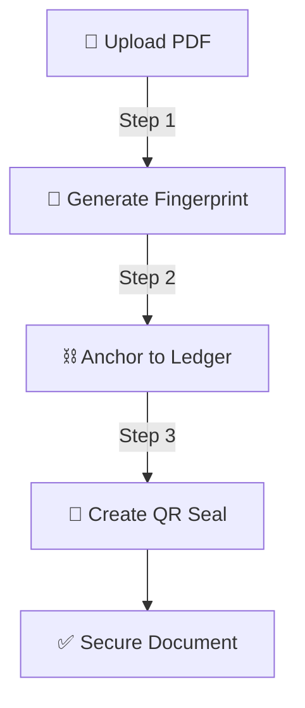

# 🚀 DocChain | Process Pipeline
> **The 3-Step Cryptographic Journey**

---

## 🏗️ How it Works
DocChain transforms your raw document into an immutable digital asset in three simple phases.

---

## 🛤️ The Pipeline Flow

---

## ⚡ Phase 1: Fingerprinting
*   **Upload**: Select your PDF (it never leaves your computer).
*   **Hash**: We create a unique **SHA-256 fingerprint**. 
*   **Result**: If even one comma changes, the fingerprint changes entirely.

---

## ⚡ Phase 2: Anchoring
*   **Block**: Your fingerprint is wrapped in a secure "data block".
*   **Mine**: We "mine" the block to lock it into place.
*   **Chain**: The block is linked to all previous documents, creating an unbreakable chain.

---

## ⚡ Phase 3: Sealing
*   **Encode**: All the proof is packed into a tiny JSON file.
*   **QR**: We generate a high-resilience **QR Seal**.
*   **Done**: Download your QR or a full integrity report.

---

> [!TIP]
> **Why is this secure?**
> Because everything happens locally. Your document stays on your machine, but its proof stays in the blockchain.

---
© 2026 DocChain Security Group.
