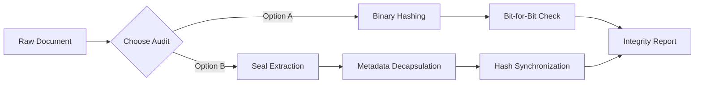

# 🛡️ DocChain | Verification Protocol Analysis
> **Version 2.1** | **Technical Reference for Cryptographic Auditing**

---

## 🏗️ Architectural Overview
DocChain provides a dual-layer verification architecture designed to eliminate the possibility of document fraud. Depending on your security requirements and the medium of the document, you can choose between **Bit-Level Binary Parity** or **QR-Anchored Cryptographic Seals**.

---

## 📊 Comparative Matrix
The following table highlights the technical divergence between the two audit protocols.

| Parameter | 💎 Bit-Level File Comparison | 💠 QR Seal Cryptographic Audit |
| :--- | :--- | :--- |
| **Trust Vector** | Direct Binary Comparison | Encapsulated Metadata Match |
| **Integrity Resolution** | Bit-Perfect Parity | Cryptographic Fingerprint Anchor |
| **Verification Medium** | Pure Digital (Vortex-to-Vortex) | Digital-to-Physical Hybrid |
| **Sensitivity** | 100% (Single-bit collision) | 99.9% (Structural Metadata) |
| **Offline Resilience** | Low (Requires source parity) | **Extreme** (Physical Seal Only) |
| **Audit Engine** | Web Crypto SubtleAPI | jsQR Vision + JSON Parsing |
| **Data Privacy** | Zero-Knowledge (Client-Side) | Zero-Knowledge (Decentralized) |
| **Performance** | O(n) based on file size | Constant O(1) Decoding |

---

## 🔄 Protocol Flow Visualization

## 🔍 Audit Parameter Schema
The following table defines the specific data points analyzed by the DocChain engine during a verification sequence.

| Parameter | Data Significance | Matching Logic | Outcome Status |
| :--- | :--- | :--- | :--- |
| **Document Hash** | SHA-256 Bit-state | Identity Check | **CRITICAL MATCH** |
| **File Name** | Document Identifier | Reference Check | Informational |
| **Genesis Timestamp**| Creation Metadata | Sequence Audit | Verified / Drift |
| **Block ID** | Ledger Position | Chain Anchor | Immutable Link |
| **Proof-of-Work** | Mining Difficulty | Immutability Verification | High-Assurance |

---

## 🚩 Why would matching fail? (Simple Explanation)
Understanding common reasons for a **MISMATCH** or **INVALID** status in plain terms.

| Scenario | What happened? | Result |
| :--- | :--- | :--- |
| **Document was edited** | Someone changed a word, a date, or even a tiny comma. | **MATCH FAILED** |
| **File was re-exported** | The file was "Saved As" or re-exported, changing its hidden data. | **INTEGRITY LOST** |
| **Wrong QR for this file**| You are scanning a QR seal that belongs to a different document. | **NOT FOUND** |
| **Seal is blurry/corrupted**| The QR code is damaged or the photo is too blurry to read. | **SCAN ERROR** |
| **Different version** | You are checking an older draft against a newer final seal. | **OUTDATED** |

---

## 🛠️ Selection Logic (Decision Tree)

### 💎 Use Bit-Level Comparison If:
*   You are performing **internal parity checks** between local storage and cloud backups.
*   The document contains **complex structural elements** where even invisible metadata changes are unacceptable.
*   You have direct access to the **Original Master File**.

### 💠 Use QR Seal Audit If:
*   The document will be **printed, scanned, or physically shared**.
*   The auditor does **not have direct access** to the original digital repository.
*   You need to establish **Immutable Truth** that persists across different file formats.

---

> [!IMPORTANT]
> Both protocols operate under a **Zero-Knowledge Architecture**. DocChain never uploads your binary data or seal payloads to any server. All cryptographic operations are executed in a sandboxed client-side environment.

---
© 2026 DocChain Security Group. All rights reserved.
